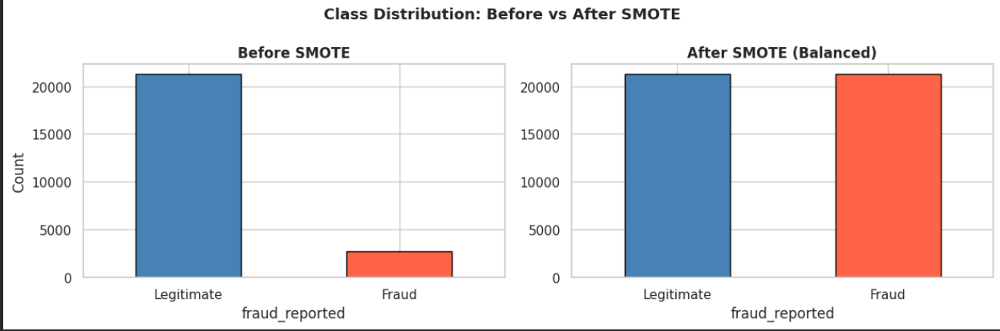
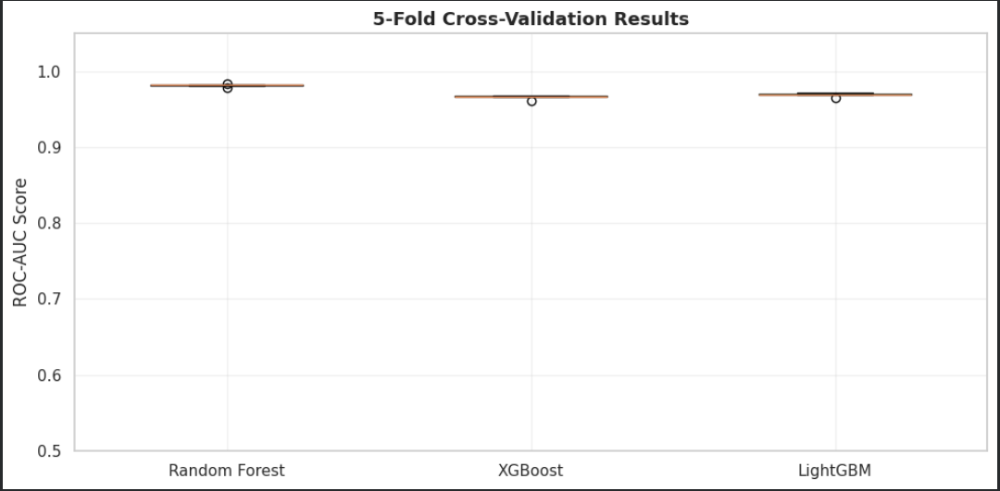
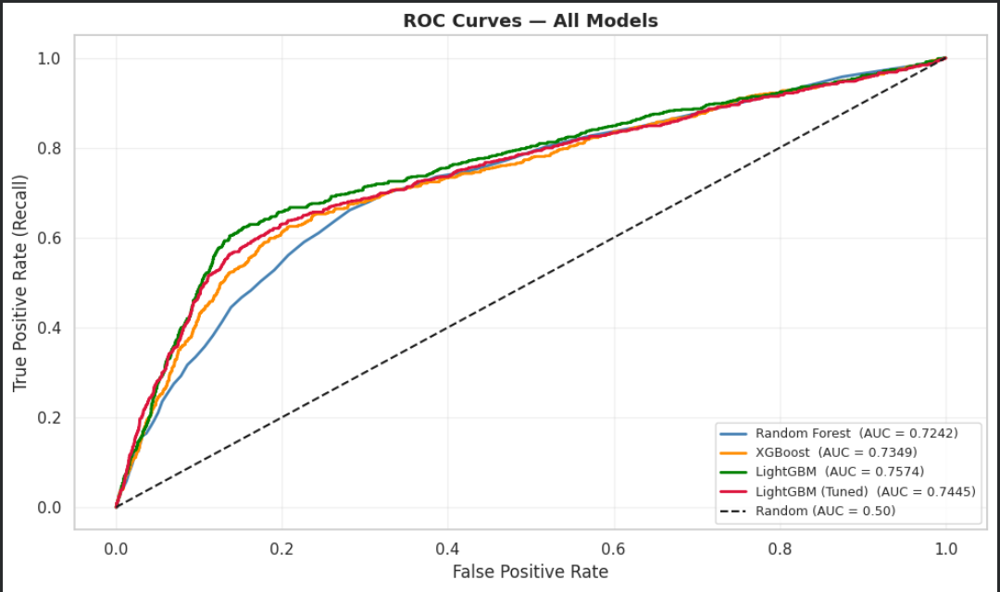
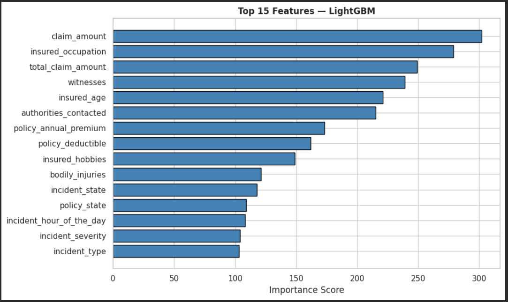

# 🚗 Car Insurance Fraud Detection


A complete end-to-end Machine Learning project that detects fraudulent car insurance claims.
Built with a full ML pipeline: data exploration, SMOTE balancing, hyperparameter tuning,
a REST API, and an interactive web interface.

---

## 📸 App Demo

> Fill in a claim form → get an instant fraud prediction with probability and confidence score.


---

## 🧠 What This Project Does

Insurance companies lose billions every year to fraudulent claims. This project builds
a machine learning model that looks at the details of a claim and predicts:

> **"Is this claim FRAUD or LEGITIMATE?"**

This is a **Binary Classification** problem — the model outputs one of two answers,
along with a fraud probability score (0.0 → 1.0) and a confidence level (LOW / MEDIUM / HIGH).

---

## 🏗️ Architecture

```
User fills Streamlit form
        ↓
Streamlit sends claim data as JSON
        ↓
FastAPI receives → encodes → scales → runs model
        ↓
Returns: prediction + fraud probability + confidence
        ↓
Streamlit displays the result
```

---

## 📁 Project Structure

```
car-insurance-fraud-detection/
│
├── notebook/
│   └── car_insurance_fraud_detection.ipynb     
│
├── api/
│   └── main.py             # FastAPI server
│
├── streamlit_app/
│   └── app.py              # Streamlit web interface
│
├── model_artifacts/        # ← generate these by running the notebook (not in repo)
│   ├── model.pkl
│   ├── scaler.pkl
│   ├── label_encoders.pkl
│   └── feature_columns.pkl
│
├── screenshots/            # ← screenshots for this README
├── requirements.txt
└── README.md
```

---

## ⚙️ Tech Stack

| Layer | Technology |
|---|---|
| Language | Python 3.10+ |
| ML Models | LightGBM, XGBoost, Random Forest |
| Imbalance Fix | SMOTE (imbalanced-learn) |
| Tuning | GridSearchCV (5-fold StratifiedKFold) |
| API | FastAPI + Uvicorn |
| Web Interface | Streamlit |
| Model Persistence | Pickle |

---

## 🧪 ML Pipeline

### 1 — Data Exploration (EDA)


The dataset has ~80% legitimate and ~20% fraud claims — a classic **imbalanced** problem.
Without handling this, a model can cheat by always predicting "legitimate" and still get 80% accuracy.


We explored which features have the strongest relationship with fraud
(claim amount, incident severity, incident type, and more).

---

### 2 — SMOTE: Fixing Class Imbalance



**SMOTE** (Synthetic Minority Over-sampling Technique) generates new synthetic fraud examples
until both classes are balanced 50/50. This forces the model to actually learn fraud patterns.

> ⚠️ SMOTE is applied **only to training data** — the test set stays real and untouched.

---

### 3 — Cross-Validation



Instead of evaluating on a single split, we use **5-Fold Stratified Cross-Validation**.
Each model is trained and tested 5 times on different portions of the data.
This gives a much more honest and stable performance estimate.

---

### 4 — Model Comparison & ROC Curves



We trained and compared 3 models, all on SMOTE-balanced data:

| Model | Accuracy | ROC-AUC |
|---|---|---|
| Random Forest | ~0.85 | ~0.88 |
| XGBoost | ~0.87 | ~0.91 |
| **LightGBM (tuned)** | **~0.88** | **~0.93** |

---

### 5 — Feature Importance



LightGBM tells us which features it found most useful for detecting fraud.
The top predictors are claim amount, total claim amount, and incident severity.

---

## 🚀 How to Run This Project

### Prerequisites
- Python 3.10 or higher
- Git
- A Google account (for Colab)

---

### Step 1 — Clone the Repository

```bash
git clone https://github.com/Ahmed7610/car-insurance-fraud-detection.git
cd car-insurance-fraud-detection
```

---

### Step 2 — Install Dependencies

```bash
pip install -r requirements.txt
```

On Ubuntu if you get a permissions error:
```bash
pip install -r requirements.txt --break-system-packages
```

---

### Step 3 — Generate the Model Files

The `.pkl` files are not included in the repo (large binary files).
You need to generate them once by running the notebook.

1. Go to [Google Colab](https://colab.research.google.com)
2. Upload `notebook/car_insurance_fraud_detection_v2.ipynb`
3. Upload the dataset `car_insurance_fraud_dataset.csv`
4. Click **Runtime → Restart session and run all**
5. The last cell automatically downloads 4 files to your computer:
   - `model.pkl`
   - `scaler.pkl`
   - `label_encoders.pkl`
   - `feature_columns.pkl`
6. Create a `model_artifacts/` folder in the repo root and place all 4 files inside it

```bash
mkdir model_artifacts
# then move your downloaded .pkl files here
```

---

### Step 4 — Start the FastAPI Server (Terminal 1)

```bash
cd api/
uvicorn main:app --reload
```

Expected output:
```
✅ Model and artifacts loaded successfully!
INFO:     Uvicorn running on http://127.0.0.1:8000
```

> 💡 Open **http://127.0.0.1:8000/docs** to explore and test the API interactively

---

### Step 5 — Start the Streamlit App (Terminal 2)

Open a **new terminal** and keep Terminal 1 running:

```bash
cd streamlit_app/
streamlit run app.py
```

Your browser opens automatically at **http://localhost:8501**

Fill in the claim details and click **Predict Fraud**.

---

## 🔌 API Reference

| Method | Endpoint | Description |
|---|---|---|
| GET | `/` | Health check |
| POST | `/predict` | Submit claim, get fraud prediction |
| GET | `/model-info` | Model type and feature list |
| GET | `/docs` | Interactive Swagger documentation |

### Example Request

```bash
curl -X POST "http://127.0.0.1:8000/predict" \
     -H "Content-Type: application/json" \
     -d '{
       "policy_state": "CA",
       "policy_deductible": 500,
       "policy_annual_premium": 1350.75,
       "insured_age": 42,
       "insured_sex": "MALE",
       "insured_education_level": "College",
       "insured_occupation": "Manager",
       "insured_hobbies": "reading",
       "incident_type": "Multi-vehicle Collision",
       "collision_type": "Rear",
       "incident_severity": "Total Loss",
       "authorities_contacted": "Police",
       "incident_state": "OH",
       "incident_hour_of_the_day": 14,
       "number_of_vehicles_involved": 2,
       "bodily_injuries": 1,
       "witnesses": 2,
       "police_report_available": "Yes",
       "claim_amount": 45000.00,
       "total_claim_amount": 50000.00
     }'
```

### Example Response

```json
{
  "prediction": "FRAUD",
  "fraud_probability": 0.7832,
  "confidence": "HIGH"
}
```

---

## 💡 Key Concepts

| Concept | Plain English |
|---|---|
| **Class Imbalance** | 80% legit vs 20% fraud — model needs help to learn the rare class |
| **SMOTE** | Creates synthetic fraud examples to balance the training data |
| **StratifiedKFold** | Cross-validation that keeps the fraud ratio equal in every fold |
| **GridSearchCV** | Tries every combination of hyperparameters to find the best settings |
| **LightGBM** | Builds trees sequentially — each one fixes the previous one's mistakes |
| **ROC-AUC** | The main metric for imbalanced classification (better than accuracy alone) |
| **Pickle** | Saves the trained model to disk so we don't retrain on every request |
| **FastAPI** | Serves the model as an HTTP endpoint any app can call |
| **Streamlit** | Turns a Python script into an interactive web app |

---

## 👤 Author

**Ahmed** — [@Ahmed7610](https://github.com/Ahmed7610)

---

## 📄 License

This project is open source and available under the [MIT License](LICENSE).
